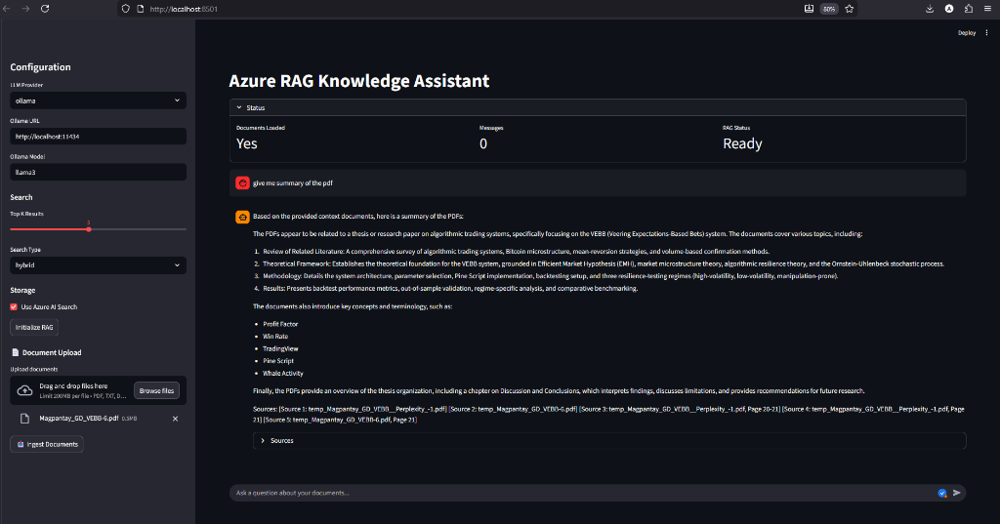

# Azure RAG Knowledge Assistant

A production-grade document Q&A system that lets you chat with your PDFs and documents using multiple AI providers.



## What It Does

Upload any document (PDF, DOCX, TXT, Markdown) and ask questions about it. The system finds relevant sections and generates accurate answers with source citations.

**Supports Multiple LLM Providers:**
- 🔷 **Azure OpenAI** (GPT-4, text-embedding-3-large)
- 🌟 **Google Gemini 2.0** Flash
- 🟢 **OpenAI** API
- 🦙 **Ollama** (local LLMs)

## How It Works

```
1. Upload Document → Split into chunks → Generate embeddings → Store in vector DB
2. Ask Question → Find similar chunks → Send to LLM → Get answer with sources
```

## Quick Start

### Prerequisites

- Python 3.10+
- API key from one of: Google AI Studio, Azure OpenAI, or OpenAI
- Ollama installed locally (optional, for local LLM)

### Setup

```bash
# Clone the repo
git clone https://github.com/AbeneilMagpantay/Azure-RAG-Knowledge-Assistant.git
cd Azure-RAG-Knowledge-Assistant

# Create virtual environment
python -m venv venv
venv\Scripts\activate  # On Mac/Linux: source venv/bin/activate

# Install dependencies
pip install -r requirements.txt

# Configure your credentials
cp .env.example .env
# Edit .env with your API keys
```

### Run

```bash
streamlit run streamlit_app.py
```

Open http://localhost:8501, select your provider, upload a document, and start asking questions.

## Configuration

Create a `.env` file with your credentials:

```env
# Google Gemini (Recommended - Easy setup)
GOOGLE_API_KEY=your-google-api-key

# Azure OpenAI (Enterprise)
AZURE_OPENAI_ENDPOINT=https://your-resource.openai.azure.com/
AZURE_OPENAI_API_KEY=your-key
AZURE_OPENAI_DEPLOYMENT=gpt-4
AZURE_OPENAI_EMBEDDING_DEPLOYMENT=text-embedding-3-large

# OpenAI
OPENAI_API_KEY=your-openai-key

# Ollama (Local)
OLLAMA_BASE_URL=http://localhost:11434
OLLAMA_MODEL=llama3
```

## Tech Stack

| Component | Technology |
|-----------|------------|
| LLM Providers | Google Gemini, Azure OpenAI, OpenAI, Ollama |
| Embeddings | text-embedding-004, text-embedding-3-large, sentence-transformers |
| Vector Store | ChromaDB, Azure AI Search |
| Framework | LangChain |
| UI | Streamlit |
| API | FastAPI |

## Features

- **Multi-Provider Support**: Switch between Google, Azure, OpenAI, or local Ollama
- **Hybrid Search**: Combines vector similarity with keyword matching
- **Real-time Streaming**: Token-by-token response streaming
- **Source Citations**: Every answer includes references to original document sections
- **Multiple File Types**: Supports PDF, DOCX, TXT, and Markdown

## Project Structure

```
├── src/
│   ├── document_processor/   # PDF/DOCX loading and chunking
│   ├── embeddings/           # Multi-provider embedding generation
│   ├── vectorstore/          # ChromaDB and Azure AI Search
│   └── rag/                  # Query pipeline and LLM chain
├── app/
│   └── api/                  # FastAPI backend
├── streamlit_app.py          # Main web interface
└── tests/                    # Unit tests
```

## License

MIT
