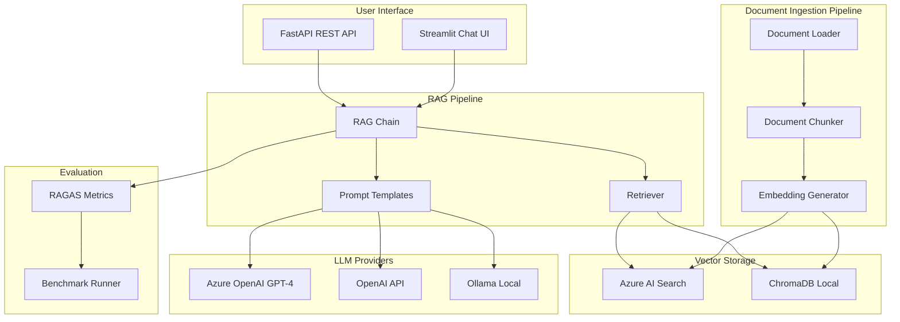

# Architecture Documentation

## System Overview

The Azure RAG Knowledge Assistant is an enterprise-grade Retrieval-Augmented Generation system that enables intelligent document querying with source citations.

## Architecture Diagram



## Component Design

### 1. Document Processing (`src/document_processor/`)

**Purpose**: Ingest and prepare documents for embedding

| Component | File | Responsibility |
|-----------|------|----------------|
| DocumentLoader | `loader.py` | Load PDF, DOCX, TXT, URLs |
| DocumentChunker | `chunker.py` | Split documents into chunks |

**Chunking Strategies**:
- **Fixed**: Simple character-based splitting with overlap
- **Semantic**: Split on paragraph boundaries
- **Recursive**: Hierarchical splitting for optimal chunk sizes

### 2. Embeddings (`src/embeddings/`)

**Purpose**: Convert text to vector representations

| Provider | Model | Dimensions |
|----------|-------|------------|
| Azure OpenAI | text-embedding-3-large | 3072 |
| OpenAI | text-embedding-3-large | 3072 |
| Local | all-MiniLM-L6-v2 | 384 |

**Features**:
- Batch processing with rate limiting
- Automatic retry on failures
- Provider abstraction for easy swapping

### 3. Vector Store (`src/vectorstore/`)

**Purpose**: Store and retrieve document embeddings

| Store | Use Case | Features |
|-------|----------|----------|
| Azure AI Search | Production | Hybrid search, scaling, SLA |
| ChromaDB | Development | Local, free, fast setup |

**Search Types**:
- **Vector**: Pure semantic similarity
- **Keyword**: Traditional text matching
- **Hybrid**: Combined approach (recommended)

### 4. RAG Pipeline (`src/rag/`)

**Purpose**: Orchestrate retrieval and generation

| Component | Responsibility |
|-----------|----------------|
| Retriever | Find relevant documents |
| Chain | Combine context with LLM |
| Prompts | Template management |

**Flow**:
```
Query → Embed → Search → Retrieve Top-K → Format Context → LLM → Response
```

### 5. Evaluation (`src/evaluation/`)

**Purpose**: Measure RAG quality

| Metric | Description |
|--------|-------------|
| Faithfulness | Answer grounded in context |
| Answer Relevancy | Addresses the question |
| Context Precision | Retrieved docs are relevant |
| Context Recall | All relevant docs retrieved |

## Data Flow

### Document Ingestion
```
File Upload → DocumentLoader → DocumentChunker → EmbeddingGenerator → VectorStore
```

### Query Processing
```
User Question → EmbeddingGenerator → VectorStore.search() → 
    RAGChain.query() → LLM.generate() → Response with Citations
```

## Configuration

### Environment Variables

| Variable | Description | Required |
|----------|-------------|----------|
| `AZURE_OPENAI_ENDPOINT` | Azure OpenAI endpoint | For Azure |
| `AZURE_OPENAI_API_KEY` | Azure OpenAI key | For Azure |
| `AZURE_SEARCH_ENDPOINT` | Azure AI Search endpoint | For Azure Search |
| `OPENAI_API_KEY` | OpenAI API key | For OpenAI |
| `CHUNK_SIZE` | Document chunk size | Optional (1000) |
| `TOP_K_RESULTS` | Search results count | Optional (5) |

## Deployment Options

### Local Development
```bash
streamlit run app/streamlit_app.py
```

### Production API
```bash
uvicorn app.api.main:app --host 0.0.0.0 --port 8000
```

### Azure Deployment
- Azure App Service (Web App)
- Azure Container Apps
- Azure Kubernetes Service
